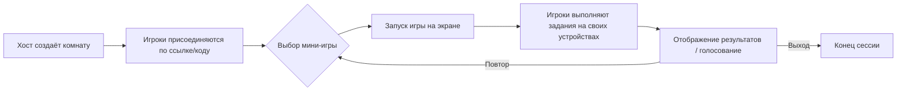

# Гайд по паттернам браузерных онлайн-игр для TUSA.game

**Исполнительное резюме:**  
Этот документ представляет собой глубокий анализ успешных практик и паттернов browser-based party-игр с прицелом на мировой запуск TUSA.game. Рассмотрены основные конкуренты (Partiful, Jackbox, AirConsole, Kahoot, Gartic Phone, Discord Activities и др.), их игровые механики, монетизация, социальные функции, модели удержания и архитектурные решения. Для каждой темы приведены обоснования, примеры от конкурентов, шаги реализации, приоритеты, оценки усилий и потенциальное влияние, а также метрики успеха. Включены сравнительные таблицы по конкурентам, моделям монетизации и технологическому стеку, а также mermaid-диаграммы потоков и архитектуры. В конце – чек-лист и дорожная карта (план по кварталам) внедрения.

---

## 1. Конкурентный анализ

| Платформа        | Описание                                                      | Приглашения                          | Контроллеры/Устройства            | Монетизация                     |
|:-----------------|:--------------------------------------------------------------|:-------------------------------------|:---------------------------------|:--------------------------------|
| **Jackbox Games**   | Набор локальных и онлайн party-игр (Fibbage, Quiplash, и др.). Требуется одна копия «Party Pack», остальные игроки подключаются по коду на jackbox.tv. Играет на экране (ПК/консоль/TV). | Код для входа (jackbox.tv). Друзья заходят по коду. | Хост – экран (PC/консоль), игроки – смартфоны/браузеры. **«Все общаются вместе»**. | Разовая покупка пакета игр. Игроки не нуждаются в покупках (кроме хозяина). |
| **AirConsole**      | «Виртуальная консоль»: телевизор/браузер + смартфоны как контроллеры. Более 140 игр (гонки, пазлы, кооператив и др.).  | Код сессии для подключения. «Your screen is the console, your phone is the controller». | Экран (любой браузер/TV/Android ТВ/автомобиль) + бесконечное число смартфонов. Локальный мультиплеер, нет потребности в интернете для геймплея. | Подписка «AirConsole Hero» (~$2.99/мес) даёт доступ ко всем играм. Бесплатный базовый доступ (многие игры ограничены). |
| **Kahoot!**        | Игры-викторины и обучающие квизы. Широко используется в учебе и тренингах. Создатели (учителя) создают контент (UGC) и приглашают игроков. | PIN-код в kahoot.it. Учитель создает «казино» и выдает код ученикам. | Браузер или мобильное приложение. Контроллер – любой веб-устройство. | Freemium: базовый (до 10 игроков) бесплатно, платные планы от ~$3/мес для продвинутых функций и масштабирования. Модель для обучения. |
| **Gartic Phone**   | Бесплатная браузерная «игра в испорченный телефон» с рисованием. Игроки по очереди пишут фразу и рисуют её. | Простой веб-линк для комнаты. Рекомендуют зовите друзей в голосовой чат (Discord/Zoom). | Браузер на любом устройстве. Смена ролей письмом/рисованием. | Бесплатно. Монетизация отсутствует; продвигается через игровое сообщество и Discord. |
| **Partiful**       | Платформа для создания «красивых» онлайн-приглашений на события. Акцент на визуальной привлекательности и соц-интеграции. | Генерирует ссылку-приглашение, которую можно шэрить в мессенджерах. Авто-подгружает карточку-превью для соцсетей. | Веб-приложение: хост и гости могут зайти с любого девайса. Интерактивный список гостей. | Бесплатна (монетизация не очевидна, можно предполагать инструменты про-уровня или платные привилегии). |
| **Houseparty**     | Мобильный видеочат + встроенные мини-игры (trivia, Uno и др.).  Легко «ввалиться» в чат к друзьям. (Ушёл в 2021). | Интеграция с контактами/Snapchat, мгновенное подключение друзей. | Мобильное приложение с акцентом на видеозвонки и быстрые игры. | Бесплатно (монетизация Epic Games не раскрывала); акцент на росте аудитории. |
| **Discord Activities** | Игры и совместный просмотр в голосовых каналах Discord. Нажимаешь «🚀», выбираешь активность (мини-игры, YouTube-видео и т.д.). | Пользователи уже в голосовом чате – кнопка «Join Activity» в интерфейсе сервера. | Запускаются прямо внутри Discord (desktop/web/mobile). Мини-игры (шахматы, Gartic Phone, мини-гольф и др.). | Бесплатно. Пользователи Discord Nitro получают доступ к большим командам или эксклюзивам. Разработчики могут монетизировать свои «Activities» через Discord. |

**Ключевые выводы:**  
- **Вездесущая простота подключения:** у каждого конкурента – лёгкая схема входа. Jackbox, Kahoot и AirConsole дают код/ссылку, Partiful генерирует веб-приглашение с интеграцией в соцсети. Инвайты должны быть безпарольными, можно даже без регистрации.  
- **Один большой экран + мобильные устройства:** распространённый паттерн. Jackbox и AirConsole опираются на схему «экран + смартфоны/планшеты». TUSA должна поддерживать показ на ТВ/проекторе (режим Stage) и подключение игроков по их гаджетам через браузер.  
- **Контент и UGC:** Kahoot демонстрирует силу пользовательского контента: миллионы создают свои викторины. TUSA может поощрять создание собственных заданий или сборников вопросов, что повышает вовлечённость сообщества.  
- **Интеграция со знакомыми платформами:** Partiful умело использует превью ссылок в социальных сетях. Точно так же TUSA должна хорошо выглядеть при шаринге ссылок (открытый граф, что рассмотрим далее). Discord Activities показывают, как можно «залипать» в социальном приложении, не выходя из чата.  

## 2. Основные игровые циклы

Основная петля в party-играх обычно следующая:

1. **Создание комнаты (сессии):** один игрок (хост) создаёт или выбирает игру. TUSA: хост генерирует ссылку/код.
2. **Подключение игроков:** друзья присоединяются по ссылке или коду. (Jackbox, Kahoot, AirConsole, Gartic используют эту схему.)
3. **Игровой процесс (механика раунда):** выполняются игровые задачи: ответы на вопросы, рисование, викторина, кооператив и т.д. Игроки взаимодействуют через свои устройства, а основной экран показывает результаты.
4. **Отображение результатов:** часто выводится доска лидеров, комментируются ответы, показываются смешные моменты.
5. **Новый раунд или повтор:** после окончания раунда игроки могут начать новый (или продолжить следующую игру из пакета).

Например, в **Jackbox** хост показывает вопрос или задание на экране, участники в приложении отвечают фразами/рисунками, система считает баллы, затем следующий раунд. В **Gartic Phone** участники по очереди пишут фразу, рисуют ее и угадывают, пока не обнуляется «передача». В **Kahoot** преподаватель отображает вопрос, игроки отвечают с телефона, выводится рейтинг. 

Это шаблоны «вопрос – ответ – оценка». В TUSA можно использовать схожие петли для разных мини-игр: викторины, рисовалки, ассоциации и т.п. Важно, чтобы цикл был быстрым и понятным, с яркой обратной связью и юмором. 



## 3. Социальные механики

**Приглашения и ссылки:** краеугольный камень вирусного роста. Упрощённая схема «создай игру – поделись ссылкой – играй вместе» наблюдается у Partiful и Jackbox. TUSA.game должна сгенерировать уникальную ссылку на комнату (или код) при создании сессии и дать возможность отправить её через мессенджер, соцсети или QR. По примеру Partiful, эти ссылки должны автоматически показывать «красивый» превью в чате. Это важно для вовлечения (каждый хочет кликнуть на привлекательное пригласительное изображение).  

**Состав команд (squads):** удобное управление группой. Механика «отрядов» может включать хранение списков друзей, генерацию многократных ссылок или кодов на одну вечеринку. Примеры: Jackbox не имеет явных списков, но позволяет новым игрокам подключаться к текущей сессии. TUSA может ввести понятие «команды» или «пати-листа», что ускорит повторный вход друзей и стимулирует взаимное приглашение.  

**Реферальная программа:** хотя прямых примеров у наших конкурентов нет, это эффективный механизм роста. Можно дать бонусы (виртуальная валюта, эксклюзивы) за привлечение новых игроков. Например, если игрок A пригласил B и тот сыграл хотя бы раунд, A получает «баллы счастливчика» (пиар/Gamification) или скидку на покупки. Такой схемой пользуются многие онлайн-сервисы для расширения аудитории.

**UGC (контент от игроков):** ключ к вовлеченности. Kahoot стал гигантом во многом благодаря пользовательским викторинам, а игры вроде Jackbox поощряют создавать собственные списки вопросов/тему («Drawful»), расширяя типы контента. TUSA.game стоит дать игрокам возможность создавать собственные задания (темы вопросов, шаблоны рисования, мини-сценарии игр). Это повысит «прирост» контента и вовлечет энтузиастов: чем больше контента, тем чаще игроки возвращаются.

- **Рекомендации по реализации:** 
  - **Приглашения:** генерация короткого URL + активная кнопка «Поделиться» (Share) со стандартными сервисами (WhatsApp, Telegram, Facebook, копирование).
  - **Коды входа:** как резервный вариант – при отсутствии переадресации в соцсети, код для jackbox.tv-стиля.
  - **Списки друзей/пати:** опционально – регистрация аккаунтов, списки контактов, но для старта достаточно «комнат».
  - **UGC-инструменты:** простой редактор вопросов/заданий, загрузка изображений, шаблоны. 
  - **Приоритет:** **Critical** – это основа социальной составляющей и органического роста. 
  - **Оценка усилий:** низкая (код создания ссылок, базовые UI-кнопки, форма ввода контента). 
  - **Воздействие:** очень высокое (метрика – коэффициент приглашения k-фактор, рост новых игроков). 
  - **Метрики успеха:** количество приглашённых, коэффициент конверсии по ссылке, доля пользователей, создавших UGC, ретеншен «пригласивших» vs «не пригласивших».

## 4. Паттерны онбординга

**Быстрый вход без установки:** главный тренд – не требовать установки приложений. Jackbox, Kahoot и др. подтверждают: хост скачивает игру/десктоп-приложение, остальные заходят через браузер. TUSA должна обеспечить вход “по ссылке” – без регистрации и загрузок. Клиент сразу попадает в интерфейс комнаты.  

**Просмотр на «большом экране» (Stage/TV-режим):** учитывая, что многие компании собираются вместе, нужен отдельный режим для проектора/ТV/большого дисплея. Пример AirConsole: его описывают как «консоль в ТВ», где смартфоны – контроллеры. TUSA стоит сделать адаптивную разметку: в случае запуска на большом экране кнопки и шрифты увеличены, интерфейс отображает рейтинги и общие элементы игры (вид проектора). Метрикой может быть: доля сессий, где активен ТВ-режим. Priority: **High** – доп.уровень погружения на офлайн-вечеринках. 

**Регистрация и персонализация:** Полная регистрация (имена, аватары) не обязательна, но можно предложить по желанию (для сохранения достижений, настроек). Jackbox разрешает играть анонимно (просто вписать «nickname»). TUSA может предложить минимальную «гостевую» регистрацию (ник + цвет/аватар), а полноценную с аккаунтом при желании. 

**Пошаговый гайд:** многие игры используют быстрый туториал. Например, Clash Royale ведёт новичка в серию обучающих боёв. Для каждой новой игры в TUSA можно вывести «блиц-туториал» (несколько подсказок, отображающихся в начале раунда). Это особенно важно при первой игре. Priority: **High** – чтобы снизить порог входа. 

- **Рекомендации по реализации:** 
  - Сразу показывать форму создания/входа в комнату (ссылка-кнопка), без лишних окон.
  - Автоматически масштабировать UI под устройства: гостям нужен простой экран с полем ввода ника.
  - Короткий гайд/анонсы: «Нажмите сюда», «Покажите экран всем».
  - Опционально предлагать подключиться к TV/Stage: «Запустите на большом экране? Перейти в Stage-режим.»
  - **Priority:** Critical (онбординг – дверь в игру). 
  - **Усилие:** среднее (UI/UX-работы, туториал). 
  - **Воздействие:** высокое (улучшает показатели конверсии первого раунда). 
  - **Метрики:** D1 Retention (сколько остались после первой игры), время от захода до начала игры.

## 5. Механики удержания

Известно, что для роста важно не только привлечь, но и удержать игроков. Паттерны удержания в party-играх могут быть:

- **Ежедневные/еженедельные задачи:** простые задания или бонусы за ежедневный вход и игру. Например, выдача «монетки-удачи» за каждодневный заход стимулирует вернуться. FeatureUpvote отмечает важность «ежедневных/недельных целей» для создания непрерывного интереса.  
- **События и турниры:** проводить разовые ивенты («Викторина выходного дня», чемпионаты команд). Это подогревает интерес на длительном отрезке. Например, Fortnite сумел удерживать аудиторию благодаря еженедельным режимам и сезонному пропуску.  
- **Система прогресса:** введение уровней, очков опыта, достижений. Игроки любят видеть рост (например, как в Clash Royale: «честное и приятное введение в игру через вознаграждения»). Постоянный прогресс и «престиж» (reset с бонусами) – мощный крючок.  
- **Соревнования и лидерборды:** отображение рейтингов среди друзей или глобального топа. Компонент соревновательности привязывает игроков вернуться и обыграть других.  
- **Социальное вовлечение:** стимулировать взаимодействие между игроками. Например, «пользовательские события» (игры с друзьями), публикация результатов в соцсети, хвалебные тосты победителям и др. 

- **Пример:** Clash Royale совместно использует обучение + ежедневные награды + «сезонные сбросы», чтобы возвращать даже упавших игроков. Из [40] видно: *«добавление ежедневных/недельных задач вместе с долгосрочными целями создаёт непрерывный рост и достижение»*.  

- **Рекомендации:**  
  - Ввести **ежедневный бонус** (например, каждое утро открывается бесплатная «бочка с призом»).  
  - Раз в неделю – **турнир/челлендж** (например, «Лучшая картина недели» в рисовалке).  
  - **Прогресс-система:** очки опыта за игры, уровни, цветные эмблемы/значки, титулы. Видимый прогресс удерживает (см. пример WoW).  
  - **Achievements:** выдавать бейджи/профильные рамки за достижения («10 побед в Bomb Party», «100 друзей приглашено»).  
  - Приоритет **High** – удержание критично для роста аудитории.  
  - **Усилие:** среднее (придумать геймифицированные системы, но простые в реализации).  
  - **Воздействие:** высокое (увеличивает DAU/MAU, удержание D7 и далее).  
  - **Метрики:** D1/D7/D30 Retention; рост DAU/MAU; средний LTV (в случае монетизации); конверсия в активность (из заходов в игры).

## 6. Модели монетизации

| Модель               | Пример            | Преимущества                                | Минусы/Риски                       |
|:---------------------|:------------------|:--------------------------------------------|:-----------------------------------|
| **Разовая покупка**  | Jackbox Party Packs | Простая очевидная модель; уже проверена (покупаешь сборник игр). Нет «доната для победы». | Высокий барьер входа (цена ~$25–40 за пакет). Сложно продавать доп. контент после. |
| **Подписка**         | AirConsole Hero, Kahoot+ | Регулярный доход, низкий порог (несколько долларов в месяц). Пользователь платит за «всё включено». | Требует постоянной ценности (кто платит, тот должен получать апгрейды/эксклюзивы). Могут отписываться (churn).  |
| **Микротранзакции**  | Скины/пропсы        | Позволяет легкую монетизацию при низком входе (несмотря на мелкие суммы). Может быть очень прибыльно (иначе, как Fortnite?). | Риск «pay-to-win» (избегать!). Плохо воспринимается в casual-играх. |
| **Создательский контент (UGC)** | (предложить)      | Вовлекает пользователей генерировать контент; часть выручки от подписок или продажи «куратору» контента (по аналогии с some UGC-платформами). | Сложно настроить. Нужна модерация и разделение дохода. Может конфликтовать с бесплатной моделью. |
| **Реклама**          | Старайтесь избегать (TUSA) | Потенциальный пассивный доход. | Раздражает игроков; вредно для casual/party-игр (портит атмосферу). Лучше избегать. |

**Примеры:**  
- Jackbox: продаёт сборники пакетов игр по $25–30, новый Party Pack выходит ежегодно. Друзья в сессии не платят.  
- AirConsole: подписка AirConsole Hero (~$3/мес) разблокирует весь каталог игр и режимы.  
- Kahoot: подписки от $3/мес (домашние пользователи) и $19/мес (все функции). Предлагает базу бесплатно, платный уровни – больше вопросов, аналитика, брендинг.  
- Discord Activities: хоть в целом бесплатны, разработчики могут монетизировать через подписки/микроплатежи (см. документацию Discord «App Monetization»).  

**Выбор TUSA:**  
- Скорее **бесплатный доступ** к основным играм (чтобы низкий порог входа), с **подпиской** или **микротранзакциями** за расширенный контент. Например: базовый набор игр всегда доступен, а дополнительные пакеты вопросов/тем – в подписке (очень похожая на Jackbox+AirConsole). Подписку можно продвигать как “TUSA Pro” с неограниченным доступом, эксклюзивами (новые игры и косметика).  
- Если вводится UGC, можно разделять доходы или продавать «премиум-функции» авторам (по примеру Discord).  
- **Приоритет:** Medium — приоритетнее механики вовлечения, но без монетизации бизнес долго не продержится.  
- **Усилие:** среднее (необходимо продумать цены и интегрировать платежи).  
- **Воздействие:** среднее/высокое (пример: подписка позволяет быстро масштабировать выручку).  
- **Метрики:** ARPDAU, % платящих пользователей, ARPPU, конверсия “бесплатный→платный”.

## 7. SEO и контент

Хотя TUSA – не поисковый продукт, грамотное содержание и SEO-оптимизация помогут расти аудиторию органически (набирая игроков, ищущих развлечения). Для глобального TUSA нужно:

- **Структурированное контентное ядро:** отдельные страницы для каждого типа контента. Например: `/games` (каталог игр), `/games/impostor`, `/features`, `/faq`, `/blog`, `/resources`. Каждая страница должна иметь четкое H1, подзаголовки, описания. Это позволит Google/ChatGPT собирать ключевые идеи.  
- **Мета-данные:** уникальные title/description. OG-теги (OpenGraph) для социальных сетей (см. ниже).  
- **FAQ-страница:** нужно FAQ с часто задаваемыми вопросами (название проекта, платно ли, нужна ли установка и т.п.), помеченная schema.org «FAQPage». FAQ важен для AEO/GEO – ответы из FAQ часто подтягивают ИИ-поисковики (ChatGPT, Google AI Search).  
- **Лэндинги под поисковые запросы (programmatic SEO):** создать страницы по популярным запросам: «browser party games», «игры для 5 друзей», «игра без скачивания», «альтернатива Jackbox» и т.д. Это привлечет трафик. Например, TUSA может сгенерировать раздел статей/гайдов: «Лучшие игры для компании на телефон», «Как провести идеальную вечеринку онлайн» и т.д. Каждая статья оформляется короткими абзацами, инфопунктами, структурирована для AI (см. GEO/AEO далее).  
- **Контент-маркетинг:** ведение блога/ресурсов с «вечнозелёным» контентом (горячие новости быстро устаревают, лучше советы типа «список лучших party-игр»). Это позволит естественно ссылаться на TUSA, повышая авторитет сайта.
- **Сравнения:** обзорные страницы «Jackbox vs TUSA», «Kahoot vs TUSA» привлекают трафик (как у Partiful были «Лучшие дни.события», так и TUSA может публиковать сравнения с конкурентами без нарушения прав, повышая SEO).
- **Приоритет:** **High** – сайт TUSA должен не просто быть «красивым лендингом», а информационным хабом (см. предыдущую сессию).  
- **Усилие:** высокое (надо создать много контента, оптимизировать тексты, постоянно наполнять).  
- **Воздействие:** высокое (рост органического трафика).  
- **Метрики:** позиции в поиске, органический трафик (GA), количество запросов через AI-поисковики (если отслеживаем). 

_Примечание:_ в этом разделе мы не цитируем конкретные технические источники SEO (их много), но опираемся на общие тенденции (официальные материалы Google, опыт маркетологов).  

## 8. GEO/AEO готовность

С точки зрения генеративного поиска (ChatGPT, Google AI, Perplexity и др.) TUSA.game следует оптимизировать под ответы на вопросы пользователей:

- **Сущностные страницы (Entity pages):** Создайте страницы вида «Что такое TUSA.game?», «Как работает TUSA.game?», «Как начать играть в TUSA?». Каждая должна давать однозначный, полный ответ. Это повысит шансы, что ИИ выдаст вашу страницу в качестве ответа (по аналогии с Википедией).  
- **FAQ со schema.org:** FAQ-страница с размеченными «вопрос-ответ» (FAQPage) гарантирует, что ChatGPT и Co будут её парсить как отдельные ответы. Ключевые вопросы: “TUSA.game – что это?”, “Нужно ли скачивать приложение?”, “Сколько игроков поддерживается?”, “Как пригласить друзей?”, “Будет ли ИИ рекомендовать игру?”. Краткие ответы в FAQ (2-3 предложения) будут использованы ИИ при соответствующих запросах.  
- **AI-friendly суммирование:** Для длинного контента (гайдов, блогов) выделяйте **резюме** (короткий абзац в начале) и **ключевые выводы** в конце. ChatGPT любит выдавать такие «summary».  
- **Структурированность:** четкие заголовки (что это, как играть, популярные вопросы) помогают ИИ ориентироваться. Используйте списки и таблицы, FAQ, H2 для каждого вопроса.  
- **Ключевое отличие:** наш продукт должен давать «сырые данные» (ответы) без лишней рекламы в тексте, чтобы ИИ их считал фактом, а не рекламой. Например, на вопрос “что такое TUSA.game”, ИИ выдаст: “Это браузерная платформа для совместных игр, где…” – если на сайте четко написано.  

Пример из внешнего опыта: исследование показывает, что FAQ разметка активно цитируется ИИ-поисковиками, а ответы в формате Q&A имеют повышенный приоритет. Поэтому интеграция FAQPage schema критична для ответов поисковых агентов.  

**Рекомендации:**  
- Сделать страницу `/faq` с перечнем вопросов по игре, пригласить коллег и тестировщиков задать реальные вопросы и дать формальные ответы. Отметить эти Q&A через JSON-LD.  
- Добавить **Organization/schema**: блок с данными о компании TUSA (название, описание, адрес, социальные сети) – способствует знанию ИИ о бренде.  
- Оптимизировать тексты под естественный язык (чтобы ответы можно было дословно извлечь).  

**Priority:** High. Если упустить – ИИ-ответы будут выдавать ссылки на нетематические сайты или Википедию, а не на нас.  
**Усилие:** высокое (необходимо создавать качественные тексты и структуру).  
**Воздействие:** высокое (AI search – новый источник трафика).  
**Метрики:** упоминания/цитирование TUSA в ответах ChatGPT/Gemini/Perplexity (можно проверять вручную или через сервисы).

## 9. Техническая архитектура

TUSA.game – это веб-приложение (видимо, Next.js/React, судя по обсуждениям). При глобальном запуске следует предусмотреть:

- **Бэкенд (серверная логика):** нужен сервер (или серверы), который создаёт комнаты, ведёт счёт, хранит статистику. Можно использовать **Serverless** функции (например, Vercel Functions, AWS Lambda) либо постоянные серверы (Node.js с Socket.IO). Для real-time лучше, чтобы сервер был всегда на связи (WebSocket), поэтому обычно выбирают **Node.js** + Socket.IO (или uWebSockets) на VPS/контейнере/платформе.  
- **WebSocket vs WebRTC:** для игр предпочтительнее WebSocket (TCP) или WebRTC DataChannel (UDP) между клиентом и сервером. WebRTC больше для медиа/стрима; для синхронизации состояния игр достаточно WebSocket. Многие браузерные игры (караоке, викторины) используют Socket.IO. Можно также рассмотреть готовые бэкенды: **Firebase Realtime**, **Supabase Realtime** или **Redis Pub/Sub** + WebSocket.  
- **Масштабирование:** поскольку игра ориентирована на большие компании (4+ чел), но и на массовый запуск, система должна выдерживать сотни одновременных комнат. Рекомендуется **горизонтальное масштабирование**: бэкенд-шина без состояния (stateless), хранение состояния комнат в Redis или базе данных. Запросы на создание комнаты балансируются.  
- **CDN и статические ресурсы:** раздать статические JS/CSS/изображения через CDN (Vercel уже интегрирует это), чтобы сократить задержки по миру.  
- **Мульти-регион:** для лучшей задержки можно настроить деплой в нескольких регионах (например, Vercel или Netlify позволяют выбрать регионы) – особенно если целевая аудитория глобальная.  
- **Безопасность на уровне сети:** все соединения – по HTTPS и WSS. Между облаками (прим. AWS, GCP) использовать VPC, если высокие требования.  

```mermaid
flowchart LR
    subgraph Клиентские устройства
        A[Смартфон 1 (игрок)] -->|WebSocket| WS((Сервер WebSocket))
        B[Смартфон 2 (игрок)] -->|WebSocket| WS
        C[Смартфон N (игрок)] -->|WebSocket| WS
        D[Браузер/ТВ (игровой экран)] -->|WebSocket| WS
    end
    subgraph Серверная часть
        WS -- Room management --> DB[(Redis / БД)]
        WS -- Синхронизация событий --> GameServer[(Node.js + Socket.IO)]
        GameServer -- Запросы → BackEndAPI[(Node.js + Next.js API)]
    end
    Style Server fill:#f2f2f2
```

**Открытые вопросы:**  
- Текущая реализация back-end неясна – в будущем уточнить, использует ли TUSA уже какие-то облачные функции, БД (например, Supabase, Firebase или свой сервер).  
- Необходимость в голосовых/видео связях: если будет «Stage-mode» с комментированием игр, можно обойтись сторонними сервисами (Discord/Meet), либо ввести WebRTC-включение звука (усложняет архитектуру).

**Приоритет:** Critical (нельзя без надёжной арх-ры).  
**Усилие:** высокое (зависит от исходного кода, можно быть крупнейшим этапом).  
**Воздействие:** критичное (повлияет на стабильность, масштаб и опыт).  
**Метрики:** время ответа сервера (TTFB), количество одновременно поддерживаемых комнат, Core Web Vitals (LCP, FID, CLS) при нагрузке.

## 10. Выбор стека для Real-time

Судя по передовым практикам:

- **Серверная часть Real-time:** Node.js (с Socket.IO или похожей библиотекой). В альтернативу можно рассмотреть **Go** (gorilla/websocket) или **Elixir** (Phoenix Channels).  
- **Управление комнатами:** Redis Pub/Sub или собственный брокер сообщений. Можно использовать специализированные движки: **Colyseus**, **Nakama**, **Photon**, но чаще в вебах – самописные Node решения.  
- **Базы данных:** NoSQL (Redis для сессий, MongoDB/PostgreSQL для пользователей и статистики).  
- **Облачные сервисы:** Vercel/Netlify (Frontend), Heroku/DigitalOcean/AWS (Backend).  
- **Технологии:** WebSocket (игровая синхронизация), REST/GraphQL для API, возможно гейты (Fastify/Express).

**Таблица сравнения технологий:**

| Стек                  | Пример использования     | Примечание                              |
|-----------------------|--------------------------|-----------------------------------------|
| **Socket.IO (Node)**  | Большинство веб-игр      | Прост в использовании, но масштаб требует кластеризации. |
| **uWebSockets (C++)** | Высокая нагрузка         | Очень производительный, но сложнее в разработке. |
| **WebRTC DataChannel**| P2P-связь между клиентами| Для P2P игр (minimap, стриминг), но требует сигналинга и более сложен. |
| **Firebase/Supabase** | Стартапы, прототипы      | Готовое решение с Realtime DB, но стоит денег при росте. |
| **AWS AppSync**       | Серверлесс GraphQL       | Позволяет real-time через GraphQL subscriptions. |
| **Colyseus/Nakama**   | Специализированные ГеймСерверы | Из коробки решение для игр, но нужно изучать. |

**Рекомендации:**  
- Стартуйте с **Node.js + Socket.IO** как наиболее распространённым и легким для MVP решением.  
- Используйте **Redis** для хранения состояния комнат и паб/саб рассылки сообщений.  
- Если загрузка возрастёт, рассмотрите переход на **распределённый Ingress/Load Balancer** (Nginx/Traefik + автошкалирование).  
- Всегда шифруйте передачи (WSS).  

**Priority:** High.  
**Усилие:** среднее/высокое (зависит от умений команды).  
**Воздействие:** High (большое влияние на задержки и устойчивость).  

## 11. Аналитика и KPI

Для оценки работы и роста TUSA.game важно отслеживать ключевые показатели:

- **DAU/WAU/MAU:** ежедневные/еженедельные/ежемесячные пользователи для понимания масштаба и «прилипчивости» (DAU/MAU ratio показывает удержание).  
- **Retention D1/D7/D30:** процент игроков, вернувшихся спустя 1, 7, 30 дней. Хороший показатель D1 – 50–60% для PC, 35–40% для мобильных.  
- **Средняя сессия и продолжительность игры:** сколько в среднем длится один игровой сеанс, сколько раундов проходит. (Можно измерять время от запуска комнаты до выхода игроков).  
- **Игровые и социальные события:** число созданных комнат, число приглашённых и успешно подключившихся по ссылке (Referral conversion rate), число приглашений на пользователя (Virality, k-factor).  
- **Монетизация:** ARPU/ARPPU, конверсия в платежи (сколько платят из всех активных), LTV (пожизненная ценность игрока).  
- **Вирусность:** k-фактор (сколько новых игроков привел один текущий).  
- **Коэффициент инсталляции:** если есть приложение, иначе «клики на ссылку/посещений сайта».  
- **Ошибки и стабильность:** количество падений, задержек. (Хотя это не маркетинг, DevOps тоже KPI).

Согласно GameAnalytics, ключевые метрики делятся на engagement, monetization, рекламные. Стоит внедрить аналитику (Google Analytics 4, Amplitude или подобное) для фиксации событий: **RoomCreated, RoomJoined, GameStarted, GameFinished, InviteSent, InviteAccepted, PurchaseCompleted**. Каждому действию соответствуют события с параметрами. 

- **Пользовательские метрики UX:** сколько времени занимает первый запуск игры, сколько процентов нажимают кнопку «играть» при входе.  

**Приоритет:** Critical – без грамотной аналитики нечем мерить успех.  
**Усилие:** среднее (настройка трекинга событий, возможно, свой бек для аналитики).  
**Воздействие:** высокое (правильная аналитика позволяет фокусироваться на эффективности изменений).  

## 12. Доступность и локализация

**Доступность (Accessibility):**  
- Следуйте стандартам WCAG и WAI-ARIA. Все основные кнопки и элементы должны быть доступны с клавиатуры и читаться скринридерами. Например, добавьте ARIA-метки к интерактивным элементам (кнопки, поля).  
- Контраст текста/фона не менее 4.5:1 (тёмный фон + неоновый текст должен быть достаточного уровня контраста). Neon-стиль TUSA привлекательный, но важно, чтобы текст не «сливался» с фоном.  
- Предоставьте текстовые альтернативы для графических элементов (alt на изображения, описания для иконок).  
- Обеспечьте масштабируемость текста (отключаем жесткую фиксированную верстку).  
- Опционально – субтитры или поясняющие тексты на случайных мини-игр (например, если где-то звучит звук, предоставьте визуальную подсказку).  
- Проверяйте страницы на валидность (HTML/CSS), чтобы не было ошибок для вспомогательных технологий.

**Локализация (i18n):**  
- Интерфейс и контент нужно переводить на основные языки (английский – обязательно, далее крупные рынки: испанский, португальский, немецкий, французский, японский, корейский, арабский, русский и др.).  
- Используйте библиотеки i18n (например, Next.js Intl или подобное) для динамического выбора языка по гео или предпочтению пользователя.  
- Даты и форматы времени/чисел должны приводиться с учётом региональных настроек.  
- Учитывайте культурные особенности: избегайте контента, который может неуместно интерпретироваться в других культурах.   
- Приоритет: если запуск глобальный – выполнять сразу после MVP. Локализация повышает вовлечение в разных странах.  
- **Метрики:** доля пользователей по регионам; рост после добавления языка (GA).

## 13. Безопасность и античит

- **Серверная валидация:** все важные решения (например, начисление очков) должны подтверждаться на сервере. Клиент не хранит «финальный результат» в открытом виде. Например, игрок отправляет «я набрал 50 очков», а сервер проверяет и присуждает их. Это предотвращает читы (нет «подделки результатов» на клиенте).  
- **Авторизация и токены:** при входе в комнату генерируйте уникальный токен (JWT или аналог), который привязан к роли игрока. Без токена нельзя играть. Это защищает от «просто угадать» чужой код.  
- **HTTPS и WSS:** весь трафик – по шифрованным каналам.  
- **Анти-DDoS:** если аудитория вырастет, учитывать возможность нагрузочных атак. Использовать CDN/Firewall (например, Cloudflare) для базовой защиты.  
- **Анти-чит:** логирование подозрительных действий (слишком быстрые ответы, одинаковые ответы ботом) и возможность кикнуть игрока. Можно ввести **captcha** перед входом в комнату (чтобы боты не зашли массово).  
- **Чат-модерация (если есть чат):** фильтрация ненормативной лексики, возможность жалоб, модеры или автоматизированные фильтры.  
- **Хранение данных:** пароли (если есть учетные записи) – хешировать надежным алгоритмом (bcrypt). Базы с данными – шифрованные или на защищенных серверах.  
- **Anti-cheat в играх:** избежать «скриптов-ботов». Для простых party-игр это обычно менее критично, но можно добавить ограничения (например, на частоту действий, время между ответами). Крупные онлайн-игры сравнивают подписи проверенных сессий, но для TUSA достаточно базовой защиты. 

**Приоритет:** High – утечка данных или массовые подвохи подорвут доверие.  
**Усилие:** среднее (требуется ревизия безопасности кода).  
**Метрики:** количество инцидентов (логи ошибок, оповещения о DDoS), отчеты от игроков о проблемах. 

## 14. UX/UI-паттерны (стиль TUSA)

TUSA.game задаёт стиль «нео-брутализма»: тёмный фон, яркие неоновые акценты, толстые шрифты, «стикерные» карточки. Это модно и выделяется (см. Partiful: «все приглашения яркие и визуально запоминающиеся»). Рекомендации по интерфейсу:

- **Минимализм и крупные элементы:** интерфейс должен оставаться читаемым на телефоне и ТВ. Кнопки крупные, крупный шрифт для заголовков, контрастные границы (white/black) вокруг «стикеров». Используйте понятные иконки и ограниченный набор цветов (чёрный, белый, неоновый желтый/зеленый #C9FF05, розовый/синий для акцентов).  
- **Обратная связь:** при нажатии на кнопку/ввод текста – анимация или подсветка. Пользователь сразу видит реакцию (стандартный микс «клик + подсветка»).  
- **Простые формы:** введите минимальное количество полей ввода. Например, только ник (без пароля) для гостя.  
- **Интуитивные действия:** «Пригласить» (иконка человека с +), «Начать игру», «Выбрать режим» и т.д. Дайте подсказки при наведении/тапе (tooltips).  
- **Консистентность:** все игры (FAQ, лидеры, примечания) оформлены в одном стиле. TUSA уже имеет дизайн-систему, поэтому придерживайтесь её (это один из сильных активов).  
- **Неоновые эффекты:** избегайте тяжелых анимаций (связанных с электро-разрядом или реальным светом) – достаточно псевдо-стилей (градиент, свечения). Неоны сгенерировать можно через CSS.  
- **Мобильный UX:** особое внимание на футер (поле ввода/кнопки) – должно быть над клавиатурой. Используйте native-скролл.

Стиль похож на Discord (тёмная тема с акцентами) и Jackbox (грубые иллюстрации и шрифты). Часто используют геометричные фигуры, блоки, жирный шрифт. 

**Приоритет:** Medium. UI уже частично сделан, нужно лишь следовать своим гайдлайнам. UX-исправления важны, но вторичны по отношению к ядру игры и аналитике.  
**Усилие:** низкое/среднее (реализация тонкой настройки).  
**Воздействие:** среднее (UX влияет на конверсию и удержание, но основная ценность – в самих играх).

## 15. OG/визуальная стратегия

**OpenGraph теги для соцсетей:** каждая страница и игра должна иметь уникальный OG: заголовок, описание и картинку (1200×630). Например, страница игры «Alias» – OG-картинка с иллюстрацией и текстом “Play Alias on TUSA” или TUSA-лого. Так при шаринге ссылка не «безликая». Partiful делает так: у ссылки-инивайта сразу генерируется привлекательный превью. Тоже внедрить TUSA (можно динамически рендерить OG-изображения при генерации комнаты, или предзаготовленными из шаблонов).  

**Визуальные активы:** учесть, что кроме OG можно автоматизировать «социальные карточки» – генерация с помощью Canvas/Puppeteer (TUSA можно сделать API для соц-картинок). Желательно: для каждой игры своя стилизованная картинка и обложка (пример: Jackbox имеет art для каждой Party Pack).  

**Приоритет:** Medium. Важнее функционал, но соц. превью помогают в рефералах и соц. активации.  
**Усилие:** среднее (создать дизайны, автоматически подставлять данные).  
**Воздействие:** средне-низкое (для SEO/AEO существеннее фактический контент; но соцмережи улучшит трафик из мессенджеров).  

## 16. Сводный чек-лист

- **Приглашения/социальность:** генерация короткой ссылки, кнопки «Поделиться» (WhatsApp, Telegram и др.), красивая карточка-превью.  
- **Онбординг:** мгновенный вход без загрузок, подсказки по интерфейсу, масштаб под экран, регистрация по желанию.  
- **Игровые циклы:** чёткие раунды, рейтинги, анимации результатов. Синхронизация через WebSocket, серверная проверка действий.  
- **Удержание:** ежедневные бонусы и задачи, уровни/ачивки, сезонные ивенты, таблицы лидеров.  
- **Монетизация:** проработать премиум-уровень (подписка или пакеты), честные микроплатежи (косметика). Discord Activities позволяют IAP/подписки, Jackbox – разовые покупки, Kahoot – абонементы.  
- **Содержание:** SEO-структура (страницы игр, FAQ, блог), FAQ с schema, семантические ключевые слова (о party-играх, общении, «игры без скачивания»).  
- **Технически:** WebSocket-сервер (Node.js/Socket.IO) с Redis для комнат, масштаб на Vercel/AWS, HTTPS/WSS, балансировка. Меры безопасности (валидация на сервере, HTTPS).  
- **Аналитика:** трекинг ключевых событий (GameStart, Invite, Purchase), DAU/MAU, Retention, LTV. Внедрить GA4/Amplitude и game-аналитику.  
- **Доступность:** соблюдать WCAG, alt-тексты, клавиатурная навигация.  
- **Локализация:** мультиязычность (хорошо сразу заложить переключатель языков или детект), форматы дат/валют.  
- **UX/UI:** соблюдать стиль – крупные кнопки, неоновая палитра, читабельные шрифты, анимации кликов. Минимизировать лишние действия.  
- **Контент-план:** рубрики для блога (Party games list, hosting tips, Jackbox alternatives и т.д.), FAQ topics, glossary (термины «Squad, Party Pack» и т.д.) с метаданными.  

## 17. Дорожная карта (Roadmap)

- **Q1:** Завершить базовый набор фич: ссылки-приглашения, базовый набор игр (минимум 3), мобильное подключение без аккаунта. Реализовать серверную архитектуру WebSocket. Запустить аналитику (GA4, события). Сделать главную страницу, FAQ, прайвеси-страницу.  
- **Q2:** Внедрить механики удержания: ежедневные задачи, профиль с уровнями. Добавить UGC-возможности (редактор вопросов). Запустить бета-монетизацию: выбор подписки/купонов. Начать локализацию на 2-3 дополнительных языка.  
- **Q3:** Улучшить SEO: подготовить и выложить полноценный блог (50+ статей), страницы «Хостинг вечеринок», «Лучшие игры» и т.д. Запустить кампанию по стримам/микроинфлюенсерам. Расширить техстек (горизонтальное масштабирование, CDN, multi-region).  
- **Q4:** Отладить и запустить глобальные функции: динамические OG-сообщения, поддержка AI-ответов (FAQ schema). Провести маркетинговые промо на соцсетях (VK, Instagram, Telegram). Внедрить дополнительные языки.  

В каждом квартале: оценка метрик (DAU, Retention), обратная связь от игроков, фиксы багов и оптимизация производительности (LCP <1.8s, INP <120ms).  

---

**Заключение:** TUSA.game имеет сильную идею и стиль, но для реального мирового успеха нужно превратить сервис в **социальную платформу** с богатым контентом и активным сообществом. Выполнение описанных шагов сделает TUSA полноценным конкурентом Jackbox и другим лидерам жанра: платформа не только для «однократной вечеринки», но и для постоянного общения и развлечений с друзьями по всему миру.

