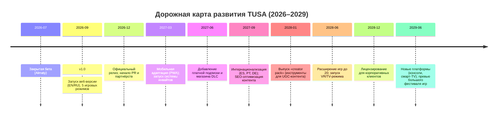

# Исполнительное резюме  
TUSA.game – это глобальная браузерная платформа для вечеринок и настольных игр, где участники присоединяются по единой ссылке без установок. Продукт сочетает **социальный чат**, **игры для групп друзей**, **инвайты** и **послевечерние активности** (фото, итоги), создавая «единое место» для подготовки и проведения вечеринок. В настоящий момент TUSA завершила закрытое бета-тестирование и готовится к публичному релизу.  

Наши исследования показывают, что рынок браузерных игр быстро растёт: по прогнозам Research and Markets, мировой объём браузерных игр вырастет до **$8,01 млрд в 2026 году и $9,07 млрд к 2030 году**. Социальные party-игры также в тренде: десятки миллионов игроков по всему миру вовлечены в коллективные игры типа Jackbox, AirConsole, Kahoot и др. На их примере видно, что запрос на простые весёлые развлечения для групп высок (например, Jackbox вырос с 100 млн до 110 млн пользователей весной 2020 года).  

TUSA позиционируется как «социальная платформа для реальных вечеринок»: сначала вы создаёте комнату и кидаете друзьям ссылку, затем все вместе играете в браузерные игры. Уникальное торговое предложение – *«ни одной загрузки»*: игрокам не нужно устанавливать ничего – достаточно открыть ссылку и выбрать ник. Ценность продукта – в гибкости (игры на любую тему), глубоком погружении (чат, фотоальбом, мемори, рекордные итоги и т.п.) и в простоте запуска. По сравнению с конкурентами TUSA объединяет **игры + социальную сеть для организаторов вечеринок** (в отличие от чисто игровых платформ или сервисов приглашений).  

Ниже представлено подробное исследование бизнеса TUSA.game: описание и позиционирование, аудитории и персоны, анализ конкурентов с табличным сравнением (Jackbox, Partiful, AirConsole, Discord Activities, Kahoot и др.), ключевые преимущества, стратегия выхода на рынок (каналы, PR, партнерства, комьюнити), модели монетизации (freemium, подписки, косметика, реклама и т.д.) с их плюсами/минусами, ценовые сценарии и трёхлетние прогнозы выручки, структура затрат, основные KPI, дорожная карта с вехами (Mermaid-таймлайн), тактики вирусного роста и рекомендации по SEO/GEO/AEO. Учитывая масштабный охват тем, отчет даёт систематические рекомендации для развития TUSA как международного продукта.  

## Описание продукта и позиционирование  
TUSA.game – это **браузерная платформа для совместного времяпрепровождения с друзьями**. Ключевые характеристики:  

- **Однозаключная организация**. Хост создаёт «комнату» — указав название и дату, получает уникальную ссылку приглашения. Все участники присоединяются через браузер по этой ссылке; никаких скачиваний приложений не требуется. Это снижает трения при входе.  
- **Игры для вечеринок**. Платформа предлагает разнообразие мультимедийных игр (викторины, рисовалки, ролевые игры и др.), рассчитанных на группы друзей. Ведущий запускает игру на общем экране (или стриме), а все игроки отвечают через свои телефоны или компьютеры.  
- **Социальная составляющая**. Помимо игр, TUSA включает мессенджер-комнату, общую галерею фото/мемов с вечеринки, систему достижений, статистику (VibeScore), а также возможность анонсирования событий (инвайты) и их ретроспективы (recap). Таким образом, платформа сопровождает тусовку «до, во время и после» и укрепляет комьюнити.  
- **Позиционирование**. На рынке TUSA позиционируется как *«социальная платформа для настоящих игровых вечеринок»*, объединяющая лучшее от Jackbox (интерактивные игры с телефоном), AirConsole (браузер-консоль) и Partiful (организация вечеринок), но с собственными фишками. Наше послание: **«Одна ссылка – бесконечно много вечеринок»**. В отличие от Jackbox, мы не делим пакеты на консоль/ПК – играют прямо в браузере. В отличие от Partiful, делаем упор не только на анонс вечеринок, но и на сам геймплей.  

 *Рисунок: друзья играют в мобильные браузерные игры вместе – иллюстрация концепции платформы TUSA.*  

## Целевые аудитории и персоны  
TUSA нацелена на **социально активных людей**, которые любят устраивать и посещать вечеринки, но не хотят тратить время на подготовку приложения. Основные сегменты:  

- **Молодые взрослые (18–30 лет)**. Студенты и молодые профессионалы (Gen Z, миллениалы). Ценят легкость (играют через браузер), новизну и социальные функции (чат, мемы). Часто отмечают дни рождения, посиделки, студенческие тусовки. Пример персонажа: *Анна, 25 лет*, организует ежемесячные вечеринки в университете, всегда хочет оригинальных игр без заморочек с техникой.  

- **Семьи и родители (30–45 лет)**. Ищут развлечения для вечеринок дома (семейные праздники, посиделки с друзьями-родителями). Нужны простые игры, где дети и взрослые могут участвовать. Персонаж: *Максим, 35 лет*, хочет провести вечер пятницы с друзьями и детьми, в развлекательной, но безопасной форме.  

- **Коллеги и удаленные команды**. Корпоративный сегмент: тимбилдинги, корпоративные вечеринки. Ищут онлайн-решения для сплочения команды. Им важны готовые к употреблению игры и аналитика результативности (кейсы роста вовлеченности). Персонаж: *Елена, 30 лет*, HR-менеджер, устраивает ежеквартальные онлайн-вечеринки для отдела, хочет быстро активировать коллег.  

- **Любители вечеринок и мероприятие-визионеры**. Люди, любящие тусовки (особенно во время пандемии вырос спрос на онлайн-развлечения). Для них важны «городские легенды» типа «Partiful-гипы», Telegram-флешмобы, мемы. Они могут быть и промоутерами: расскажут о TUSA по факту «зашло на вечеринке».  

Каждый сегмент при правильном маркетинге может заинтересоваться TUSA разными аргументами: студенты – «без установки и уже весело», семьи – «развлечения для всех возрастов», корпоративщики – «увеличение вовлечения без сложных средств». Ключевые драйверы поведения: «социальный обмен ссылкой», «экранная синергия» и «минимизация переключений (нет приложения)».  

## Конкурентный ландшафт  
В таблице ниже сравниваем TUSA с основными конкурентами: 

| **Платформа**           | **Описание**                             | **Модель монетизации**                             | **Целевые юзеры**            | **Основные плюсы**                                      | **Минусы/Ограничения**                                                 |
|-------------------------|------------------------------------------|----------------------------------------------------|------------------------------|--------------------------------------------------------|------------------------------------------------------------------------|
| **Jackbox Games**       | Платформа платных *“party-pack”* игр. Ведущий запускает игру на ПК/консоли, участники играют через веб-код на телефонах.  | Покупка наборов игр (Party Packs) на платформах (Steam, консоли). Разовые платежи.                   | Геймеры, организаторы вечеринок, стримеры. | *Очень известный бренд*. Большой выбор игр (рисовалки, викторины, «мафия»). Нет платы для участников (купить должен только хост). | Требуется устройство-хост (ПК/консоль) и экран; участникам нужно смотреть этот экран. Игра платная – барьер для новых. Фокус на англоязычные рынки. |
| **AirConsole**          | Онлайн «консоль» браузерных игр. >140 игр, смартфоны – контроллеры. Есть бесплатный доступ (ограничено 2 игроками, с рекламой) и платная подписка Hero.  | Freemium: базовые игры бесплатны (с рекламой, огранич. игроков); **AirConsole Hero** ($4.99/мес или $59.99/год) даёт безлимит игроков, без рекламы, доступ ко всем играм.  | Семьи, друзья, casual-игроки. | Много игр разного жанра. Простое подключение: запускается в браузере, бесплатно доступно сразу. Подписка Hero устраняет рекламу и снимает все ограничения. | 2 игрока бесплатно, дальше нужен Hero. Довольно агрессивная реклама в free-версии. Часть контента – промо-игры, созданные партнерами. Не фокусируется на мероприятиях/вечеринках как таковых.|
| **Discord Activities**  | Встроенные мини-игры внутри Discord. Запускаются в голосовом чате по нажатию «Ракеты». Включают «Gartic Phone», шахматы, викторины и др..  | Бесплатно (входит в сервис Discord). | Пользователи Discord-сообществ (геймеры, друзья). | Абсолютно бесплатно для всех пользователей Discord. Простое включение внутри чата. Поддержка неограниченного числа участников у некоторых игр. | Доступно только в экосистеме Discord. Ограниченный набор игр (по состоянию на 2024 год ~10-20 активностей). Требуется компьютер/мобильное приложение Discord. |
| **Kahoot!**            | Онлайн-викторины и образовательные игры. Ведущий создает «каахут», участники отвечают по коду. Акцент на обучение и корпоративные события.  | Freemium: базовые функции бесплатно (до 10 участников); платные планы (от ~$3–$19/мес) увеличивают лимит игроков (до 800+) и дают расширенные опции. Есть бизнес-планы (Kahoot 360) по сотням $/мес.  | Учителя, учащиеся, корпоративные тренеры. | Удобный конструктор викторин. Легко вовлекать большие аудитории (до сотен участников). Много готового контента. | Основной фокус – обучение/корпоративы, не вечеринки. Бесплатно мало (только до 10 игроков). При масштабной игре требует платных тарифов. Шаблонный геймплей (викторины). |
| **Partiful**           | Сервис создания онлайн-приглашений (invite pages) с RSVP, чатами и альбомами. Аналог «Facebook Events» для молодежи. Бесплатен полностью.  | Бесплатно. Недавно добавлена опция продажи билетов (комиссия от продаж). | Охотники на вечеринки, организаторы (Gen Z, миллениалы).  | Интуитивные страницы приглашений: быстрый дизайн, SMS-рассылки, альбом событий. Высокая популярность среди молодежи (Series А, ценность >$100M). 100% бесплатен. | Не предлагает сами игры – только организацию событий. Может использоваться в связке с TUSA для анонсов, но не заменяет игровую платформу. Конкурент за внимание социальных тусовок, но дополняет тему мероприятий. |
| **Прочие примеры**     | *Houseparty*, *CrowdGames*, *SpeedQuizzing* и др. | Разные (часто freemium или разовые покупки). | Разные (семьи, конференции). | Иногда локальные особенности (напр. игры в автомобилье) или интеграция с ТВ. | Малопопулярны по сравнению с перечисленными. |

Таким образом, TUSA ведёт игру в пересекающейся области: как Jackbox и AirConsole она даёт интерактивные игры с телефоном; как Discord – простоту доступа и мультиплеерную поддержку; как Partiful – социально-ориентированные функции (чат, фотоальбом, RSVP), собирая вечеринку «под одной крышей». Наша цель – объединить эти сильные стороны и устранить их слабые места (отсутствие приложения Jackbox, отсутствие игр у Partiful, высокую стоимость Jackbox/AirConsole Hero и т.д.).  

## Уникальные ценностные предложения и ключевые функции  
TUSA предлагает несколько конкурентных преимуществ:  

- **Никаких загрузок, все на Link-invite**. Удобство – наше главное УТП. Как и у Jackbox, игроки получают код комнаты, но дополнительно мы исключаем даже простую регистрацию. Один клик по ссылке и игрок в вечеринке. Это снимает барьеры входа.  

- **Современные party-игры и гибкость**. Каталог TUSA охватывает основные популярные форматы: викторины, ролевые игры, рисовалки, голосовые игры и др. Мы можем быстро добавлять новые мини-игры (в перспективе UGC-библиотеку, подобно App Store для вечеринок). В играх мы используем опыт Jackbox (системы скрытых ролей, рисовалок, опросов) и AirConsole (мультиплеер через телефон).  

- **Суперчаты и контент вечеринок**. После вечеринки можно пересмотреть фото/скриншоты из игр, сохранить историю смешных ответов, отправить отзыва о мероприятии. Мы превращаем случайную вечеринку в долгосрочное событие. Это усиливает вовлеченность – друзья и семьи будут возвращаться за памятью о предыдущих тусовках.  

- **Гемификация и экономия времени**. Система достижений и внутренняя «валюта» KOINS повышает удержание (игроки получают бонусы за участие, отвеченные вопросы и т.д.). В будущем можно предложить косметические апгрейды (смайлики, скины для аватарок). Кроме того, платформа сама организует напоминания о грядущей вечеринке (всплывающие уведомления по приглашению), как у Partiful, экономя время организатора.  

- **Интеграция «до и после»**. TUSA задумывается не только как место для игр, но и как «сервис мероприятия»: создание страницы события с опросом «когда лучше встретиться», чат до встречи, покупка виртуальных билетов или билетов на реальные активности (в будущем можно продавать брендированные товары). Это расширяет продуктовую линейку за пределы просто игр.  

Эти функции сочетались бы в маркетинге примерно так: *«Где больше, чем игры. TUSA связывает ваших друзей, собирая их вокруг одного экрана — и остаётся с вами после последнего раунда»*. Такое позиционирование выгодно отличает нас от «только игр» (Jackbox, Discord) и «только RSVPs» (Partiful).  

## Стратегия выхода на рынок (GTM)  
Стартовать нужно комплексно:  

- **Основные каналы продвижения**: социальные сети (TikTok, Instagram, VK, Telegram) с короткими весёлыми видео, показывающими, как друзья играют через ссылки. Имеет смысл запускать челленджи в TikTok вроде «вызови друзей сыграть с тебя» или мемы о вечеринках.  
- **Партнёрства и коллаборации**: работать с популярными стримерами и блогерами (желательно тематически близкими – комики, ведущие вечеринок, инди-разработчики игр). Это видно по успеху Jackbox, когда стримеры организуют «тусовки в Zoom с Jackbox» (см. пример их клиентов). Также возможны партнёрства с эвент-агентствами (они могут предлагать TUSA для онлайн-активностей на собраниях, свадьбах).  
- **PR и медиа**: осветить запуск в профильных СМИ (игровых и лайфстайл-журналах). Можно подчёркивать «Made in KZ» как историю успеха казахстанской стартап-сцены (но без ограничения локальностью). Пресс-релизы о найме известных экспертов, запуске новых игр и т.п.  
- **Комьюнити**: создать и вести Discord/Telegram сообщество фанатов (как сделали Partiful и Jackbox). Публиковать гайды, стримы, проводить AMA, создавать UGC (пользовательский контент – мемы, шутки про игры). Поощрять создание плейлистов игр и шаблонов вечеринок, которые можно копировать.  
- **Вирусная реферальная программа**: дать бонусы за приглашение новых игроков. Например, если пользователь пригласил 3 друзей, открыть ему новую игру или дать внутриигровую валюту. Это стимулирует естественное распространение по цепочкам друзей.  
- **Низко-бюджетные тактики**: совместные акции с офлайн-барными тусовками (QR-код на баре – «сканируй и играй прямо здесь»), «парти-киты» (печать карточек с кодом комнаты), использование мемов и актуальных трендов.  

Пропаганда нацелена на персонализованное использование: например, делимся кейсами «соберись с друзьями за карточками ТУСА+пицца» или «вечеринка Лиги ива». Нельзя забывать и про SEO: на старте создать англоязычный контент (Блог, FAQ) о том, как устроить идеальную игровую вечеринку.  

## Модели монетизации  
Мы рассматриваем мультиканальный подход:  

- **Freemium + подписка**. Базовые игры и функционал (создание комнаты, несколько игр, чат, фотоальбом) бесплатно. Платная подписка (ежемесячная/годовая) открывает премиум-аккаунт: доступ к эксклюзивным играм, расширенный пакет чатов (несколько комнат), скин-паки для профиля, убирает рекламу (если будет). Такой подход похож на AirConsole Hero и Kahoot+ (выше 10 игроков за подписку).  
- **Премиальные игровые наборы**. Как Jackbox продаёт *Party Packs*, TUSA может выпускать собственные «Пакеты вечеринок»: наборы из 5–10 эксклюзивных игр по тематике (например, для Дня рождения, Хэллоуина, корпоратива). Пользователь покупает единоразово, остальные игроки снова ничего не платят. Плюс: партнёрские сборники с брендами (в дальнейшем, совместные с медийными франшизами).  
- **Реклама и спонсорство**. Интеграция ненавязчивой рекламы в бесплатной версии (баннеры на экране ожидания, рекламные паузы между раундами). Можно продавать «брендинговые вечера» спонсорам (например, вечеринка-соревнование, где викторины посвящены продукту спонсора). Однако нужно балансировать: излишняя реклама убьет UX.  
- **Виртуальные товары**. Аватары, скины для игровых интерфейсов, «эмодзи-смайлы» – всё, что персонализирует игру. Покупается за внутриигровые KOINS или реальные деньги. Это типичная модель у многих игр (вспомним, как Kahoot продаёт AccessPass с темами).  
- **События и турниры (B2C/корпоратив)**. Организовать платные онлайн-ивенты («вечеринка с ведущим»), вебинары по геймификации, аукционы виртуальных предметов. Также можно лицензировать платформу для бизнеса – корпоративным заказчикам предлагать White Label (брендинг под заказчика) и сервис уровня Kahoot360.  
- **Комиссии от партнёров**. Например, интеграция продажи билетов на реальные мероприятия через партнёрский API (ticketing), cоответствующие комиссии. Или платные консультации/настройки «под ключ» для организации больших массовых игр.  

Таблица моделей монетизации:

| **Модель**            | **Описание**                                                                                 | **Плюсы**                                                       | **Минусы**                                                   | **Реализация/заметки**                                       |
|-----------------------|----------------------------------------------------------------------------------------------|-----------------------------------------------------------------|-------------------------------------------------------------|--------------------------------------------------------------|
| **Freemium + Подписка**    | Бесплатный доступ к базовым функциям; подписка открывает полный функционал (много игр, без рекламы). | Массовое привлечение бесплатно, стабильный доход от подписчиков. | Преобразование пользователей в платных – сложная задача (низкая конверсия ~1–5%). Нужно регулярно добавлять контент. | Технически – добавить уровень доступа, интегрировать Google/Facebook Pay, подписки App Store. Клиентам нужна ценность, чтобы платить каждый месяц. |
| **Разовые пакеты игр (DLC)** | Продаём «паки игр» на одну вечеринку (набор из 5-10 игр с уникальной темой).  | Один раз платит только хост, групповой канал дохода, проверенная модель (Jackbox).  | Медленный рост (каждый новый клиент повторно покупает нечасто). Пираты могут обходить (скринкод/урок). | Интегрировать маркетплейс внутри платформы (как Steam). Обеспечить, чтобы купленные игры «подцеплялись» к аккаунту ведущего. |
| **Реклама**          | Баннеры/междуигровые роллы/спонсорский контент в бесплатной версии.                           | Немедленный доход за счёт трафика. Участники видят рекламу – монетизируется аудитория. | Ухудшение UX, отток пользователей, требует больших объёмов трафика. | Контролировать частоту показа. Привлекать релевантных рекламодателей (вещи для домашних вечеринок, игры, стриминговые сервисы). |
| **Виртуальные товары**  | Скины для интерфейса, аватарки, эмодзи, геймифицированные функции (например, «улучшения» для игр).  | Хороший дополнительный доход, удерживает пользователей. | Для успешной монетизации нужен качественный дизайн и регулярные «новинки». Может восприниматься как донат только хардкор-пользователями. | Встроенный магазин KOINS (вирт. валюта). Кооп-схема: дать бесплатные KOINS новичкам, предложить купить дополнительные. |
| **Платные онлайн-ивенты**  | Организация турниров и ивентов для аудиторий (концерты, школьные/корп. соревнования), билеты через платформу. | Может приносить значительный одноразовый доход. Продажи билетов – процент. | Требует затрат на организацию, маркетинг и авторитет (творческий контент). Непредсказуемые затраты. | Найти партнёров (школы, клубы, комьюнити). Запускать сертификаты участникам, т.е. «платное участие». |
| **B2B-лицензирование** | Продажа платформы компаниям (White Label, обучение, консалтинг).                                 | Высокая маржинальность от бизнес-клиентов. | Требует продажи и поддержки (sales team). Компании могут захотеть эксклюзивы или кастомизацию. | Создать тарифы для организаций (более крупные лимиты пользователей, аналитику, приоритетную поддержку). |

Каждая из этих моделей требует детальной проработки, но уже на начальной стадии мы можем запустить **Freemium + подписку** и продажу DLC-пакетов. К примеру, как у AirConsole базовый функционал бесплатный, а Hero снимает ограничения. В то же время мы готовим магазин игровых пакетов (включая оформление пакетов для праздничных локаций) – это поможет снизить зависимость от подписки и дать выбор пользователям.

## Ценовые сценарии и прогнозы выручки на 3 года  
Прогноз выручки даётся в трёх сценариях (консервативный *Worst*, базовый *Likely*, оптимистичный *Best*). В расчетах предполагаем постепенный рост юзеров и конверсии.  

- **Assumptions** (показатели на конец года, примерные):  
  - *Пользователи (Monthly Active Users)*: в консервативном сценарии – 10 000/50 000/150 000 за 3 года; в базовом – 20 000/100 000/500 000; в оптимистичном – 50 000/250 000/1 000 000.  
  - *Конверсия в платных* (люди, купившие что-то): 3–5% от активных.  
  - *Средний доход на платного пользователя (ARPPU)*: $5–15 в год (подписка/покупки).  
  - *Доп. доход на бесплатного (адрeв)*: ~$1 в год (реклама, допрoдажи).  

Таблица прогнозов (в тысячах $):  

| **Сценарий / Год** | **Год 1**  | **Год 2**  | **Год 3**  |
|--------------------|-----------:|-----------:|-----------:|
| **Worst-case**     |           |           |           |
| Активные MAU       |  10 000    |  50 000    | 150 000    |
| % платящих         |     3%    |     4%    |     5%    |
| Платящие           |    300     |   2 000    |   7 500    |
| ARPPU, $           |     5      |    10      |    15     |
| Доход от подписок и DLC | 1 500     |   20 000   |  112 500  |
| Доход от рекламы и микротранзакций | 1 000     |   10 000   |   30 000   |
| **Итого**          | **2 500**  | **30 000** | **142 500**|

| **Likely**         |           |           |           |
| Активные MAU       |  20 000    | 100 000    | 500 000    |
| % платящих         |     4%    |     5%    |     6%    |
| Платящие           |    800     |   5 000    |   30 000   |
| ARPPU, $           |    10      |    12      |    15     |
| Доход платные      | 8 000      | 60 000     | 450 000    |
| Доход рекламы      | 2 000      | 20 000     | 100 000    |
| **Итого**          | **10 000** | **80 000** | **550 000** |

| **Best-case**      |           |           |           |
| Активные MAU       |  50 000    | 250 000    |1 000 000   |
| % платящих         |     5%    |     6%    |     8%    |
| Платящие           |  2 500     | 15 000    |   80 000   |
| ARPPU, $           |    15      |    18      |    20     |
| Доход платные      | 37 500     | 270 000   |1 600 000   |
| Доход рекламы      | 5 000      | 50 000    |  400 000   |
| **Итого**          | **42 500** | **320 000**| **2 000 000** |

*Замечания*: приведённые цифры ориентировочны и зависят от маркетинговых затрат, конверсии и окупаемости привлечения. Worst-case предполагает минимальный охват – доход начинает быть значимым ко 2-3 году. Likely – рост по S-образной кривой (x5–10 каждый год с ростом рекламных расходов). Best-case – вирусное распространение, продажа DLC и подписок выходит на первые миллионы к третьему году.

 и  дают понимание, как неочевидные поводы (пандемия, внимание СМИ) могут сильно повлиять на рост. Важно, что Jackbox при сильном росте установила инфраструктуру, а Partiful быстро захватил GenZ-базу. Мы учтём эти примеры при формировании сценариев: например, при viral-эффекте TUSA могла бы за год достичь 1 млн пользователей.

## Структура затрат и операционные расходы  
Основные статьи расходов на стартовом этапе (условно, годовые суммы в USD):  

- **Персонал**: разработчики (2–3 человека), менеджер продукта, дизайнер/UX, маркетолог. Предполагаем среднюю зарплату $60–80k/год/чел. Итого ~ $200–250k/год.  
- **Инфраструктура**: хостинг (серверы, CDN, БД), API для рассылок, лицензии (Redis, мониторинг). Около $10–20k/год на начальном этапе.  
- **Маркетинг**: digital-реклама (Google, VKontakte, TikTok), SMM, мероприятия. По крайней мере $50–100k/год, если хотим набрать первых пользователей. На низких бюджетах – несколько тысяч на таргет; на агрессивный рост – сотни тысяч.  
- **Операционные**: оплата офисов/коммуникаций (если есть), домены/сертификаты, CRM, CRM, бухгалтерия – ~$10k/год.  
- **Юридические/административные**: патент, торговая марка, бухгалтерия, GDPR-консультанты, юридическое оформление – минимум $5–10k на старте, затем сопутствующая поддержка.  
- **Прочие (непредвиденные)**: страховка, командировки – резерв ~ $10k/год.  

Таблица примерного бюджета:

| **Статья расходов** | **Год 1** | **Год 2** | **Год 3** |
|--------------------|----------:|----------:|----------:|
| Персонал (зарплаты) | 250 000   | 300 000   | 350 000   |
| Инфраструктура (серверы, CDN, API) | 15 000    | 20 000    | 25 000    |
| Маркетинг и PR     | 100 000   | 200 000   | 300 000   |
| Офис/админ/инструменты | 20 000    | 25 000    | 30 000    |
| Юридические/покупки (патенты, домен) | 10 000    | 5 000     | 5 000     |
| **Итого**         | **395 000** | **550 000** | **710 000** |

При таких расходах точка безубыточности (~OPEX = revenue) наступит в сценарии **Likely** примерно во второй год, а в **Best** – в конце первого года. В Worst-case точка безубыточности может наступить только ближе к концу третьего года. Важно, что первоначальные инвестиции должны покрыть 1.5–2 года burn rate (то есть порядка $800–900k).  

## KPI и аналитика  
Ключевые метрики для наблюдения:  
- **Активность**: Daily/Monthly Active Users (DAU/MAU), количество созданных комнат в день, длительность сессии.  
- **Вовлечённость**: среднее число раундов на игру, времени в сессии, процент завершённых игр. Retention (сколько игроков вернулись через 1, 7, 30 дней).  
- **Virality**: коэффициент K (сколько людей приглашает один пользователь), процент приглашений, конверсия приглашенных в участников.  
- **Монетизация**: ARPU (средний доход на пользователя), ARPPU (доход на платящего), LTV (пожизненная ценность), CAC (стоимость привлечения одного платящего).  
- **Product/Feature Metrics**: популярность отдельных игр (игроков на игру), время реакции в реальном времени (инфраструктурные метрики), уровень ошибок (rate conflicts, reconnects).  
- **Маркетинг и конверсии**: конверсия лендингов (регистраций), ROI рекламных кампаний, подписки vs бесплатные. Также follower growth в соцсетях, вовлеченность в сообществе (Discord, Telegram).  

Дашборд можно построить на основе Google Analytics + Mixpanel/Amplitude: с графиками MAU, cohort-retention, conversion funnel (лендинг → создание комнаты → первая игра). Основной North Star Metric предлагается: **«Еженедельные завершённые сессии с 3+ игроками»**, отражающее реальную «успешную тусовку».  

## Дорожная карта (Roadmap)  

Каждая веха подкреплена задачами: например, до конца 2026 – подготовить международный сайт и первые англоязычные статьи; в 2027 – разворачивать ядро монетизации; в 2028 – масштаб на новые рынки и форматы (СМИ-игры, события с реальной аудиторией).  

## Маркетинговая стратегия: вирусные ходы  
Низкобюджетные и креативные методы роста:

- **Челленджи и мемы**. Запускать в соцсетях челленджи типа «собери команду и играй весь вечер» с призами (поощряем победителей). Создавать мем-контент о ситуациях «когда забыли приложение, но TUSA работает в браузере».  
- **Партнёрские вечеринки**. Сотрудничать с барами/кафе – печать QR-кодов с промокодом на вечеринку (например, «сканируй и выиграй бесплатный напиток»). Вместе с барами устраивать турниры по TUSA (аналог киберспорта для вечеринок).  
- **Контент и UGC**. Поощрять пользователей публиковать в соцсетях свои «лучшие моменты» с хештегом #TUSAparty (например, скрин ответов или победную фотографию). Регулярно репостить истории из жизни комьюнити.  
- **Комьюнити-мероприятия**. Организовывать ежемесячные open-пати онлайн (своего рода Discord-вечеринки): где любой желающий может зайти и выиграть призы. В таких мероприятиях создаются хабы для общения.  
- **Growth-hacks**: например, встроенная награда за приглашение (реферальный код может давать 50 KOINS каждому) стимулирует естественный мем-контент: друзья рекомендуют приложение друг другу.  

Эти тактики комбинируются: мы можем начать с фокусных мероприятий (онлайн-вечеринки в ключевые даты) и вирусных интеграций в соцсетях, постепенно расширяя бюджет на таргетированную рекламу и SEO.  

## Юридические и IP требования  
Поскольку TUSA – глобальная платформа, нужно обеспечить юридическую чистоту:  

- **Авторские права и названия**. Убедиться, что в играх нет нелегального копипаста брендов или музыки. Например, переименовать коммерческие форматы (как уже делается у многих) – чтобы избежать претензий со стороны владельцев IP (само слово «Uno» в «Uno Tracker» может вызвать вопросы).  
- **Соблюдение законов о данных и контенте**. Разработать **Privacy Policy** и **Terms of Service** для разных регионов (GDPR, CCPA и т.д.). Дать пользователям возможность удалять и экспортировать свои данные (особенно фото и чаты). Ввести возрастные ограничения или родительский контроль, если среди игр есть рискованный контент.  
- **Модерация**. Платформа соучаствует в группах людей, потому нужен инструмент для жалоб и бана нарушителей (например, токсичный чат). Нужно предусмотреть автоматическую фильтрацию ненормативной лексики, а также правила по содержанию (альтернативы будут обучающие, поскольку есть дети).  
- **Товарный знак**. Зарегистрировать бренд TUSA в ключевых юрисдикциях, защитить лого и домены. Это важно перед крупной рекламой.  

 отмечает, что Partiful вырос во многом благодаря удобству SMS-инвайтов (Gen Z), но и предупреждает о необходимости гибкости: у Partiful, например, нет проблемы IP с играми, а у нас может возникнуть (решение – правое сопровождение и названия, далёкие от защищенных брендов).  

## Интернационализация, SEO/GEO/AEO  
TUSA – не локальная, а **глобальная** платформа. Это требует многоуровневого подхода:  

- **Многоязычность (i18n)**. Сайт и маркетинг должны быть сразу многоязычными (ENG, ESP, LATAM, PT-BR, DE и др.). SEO-структура – через URL-пути или домены (напр. tusa.game/en, tusa.game/ru), с корректными `hreflang` и локализацией метаданных для каждого языка.  
- **SEO**. Создать контент для каждой страницы:  
  - **Игры**: отдельные страницы с описанием каждого игрового режима, ключевыми словами («игры как Jackbox», «party game online»). Заполнить мета-теги, OpenGraph-карточки, схемы Schema.org (например, `CreativeWork/Game`, FAQ-код).  
  - **Польза и инструкции**: большие руководства («Как провести виртуальную вечеринку», «Лучшие игры для 6 друзей», «Как играть онлайн без установки»). Это привлекает трафик не только игроков, но и отвечает на вопросы ИИ-поисковиков (см. GEO/AEO ниже).  
  - **FAQ и опыты**: создать раздел FAQ с вопросами-ответами (например, «Нужно ли скачивать приложение?», «Сколько игроков поддерживает игра?» и т.д.), размеченный как `FAQPage`.  
- **GEO/AEO** (Answer Engine Optimization). Поисковые системы с AI-модулями (Gemini, ChatGPT Search, Perplexity) требуют структурированных данных. Надо:  
  - Добавить на страницы **rich snippets** (FAQPage, HowTo, BreadcrumbList, Organization, SoftwareApplication) через JSON-LD.  
  - Быть готовыми к формулировкам «TUSA is…», «How to play X on TUSA», «Games for Y people» и т.д. (создать контент, который ИИ может дословно цитировать).  
  - Пример: статья «Что такое TUSA.game?» (страница About с E-E-A-T информацией и цитируемыми фактами) увеличит шансы попасть в ответы AI-поиска.  
  - **Knowledge Graph**: обеспечить сущность Organization и SoftwareApp с указанием основателей, ссылки на соцсети (`sameAs`) и описанием бренда. Это поможет Google правильно идентифицировать продукт.  

- **Локальный маркетинг**. Хотя продукт глобальный, регионально можно запускать промо-кампании (в т.ч. наружная реклама в крупных городах при релизе) через перенаправление на локализованные версии сайта и страниц.  

## Риски и стратегия снижения  
Основные риски:  

- **Юридический (IP)**: использование запатентованных идей/названий игр (Uno, Kahoot и др.) может привести к судебным спорам. **Митигейт**: изначально брендинг и контент должны быть «чистыми». Переименовать игры в нейтральные наименования, использовать абстрактные графики. Иметь юридических консультантов.  

- **Масштабируемость (real-time)**: как показал рост Jackbox, наплыв игроков может ошеломить серверы. Сейчас TUSA использует in-memory SSE – на продакшене это не выдержит. **Митигейт**: сразу внедрить распределённый pub/sub (Redis, WebSocket-кластер) и горизонтальное масштабирование. Изменить polling 1.2с на событийно-ориентированную логику.  

- **Монетизация**: всегда велика вероятность невысокой конверсии (2–5%). **Митигейт**: сосредоточиться на создании ценности и лояльности (внутриигровые бонусы, VIP-функции) до внедрения paywall. Тестировать A/B разные цены/пакеты.  

- **Конкуренция**: появление новых «тусовочных» приложений (например, Facebook может интегрировать игры). **Митигейт**: занять нишу и стать стандартом среди вечеринок раньше конкурентов. Постоянно обновлять каталог игр и фокусироваться на UX.  

- **Безопасность**: риск DDoS, взломов сессий (хотя компромисс).
  **Митигейт**: стандартные меры (OWASP, rate-limiting через Redis, защита от инъекций).  

- **Регуляции**: возможные ограничения из-за азартных элементов (KOINS, ставки). **Митигейт**: явно указывать, что «KOINS – виртуальная валюта без реального обмена». Избегать механик, похожих на игры с призами или реальными выигрышами.  

- **Зависимость от платформ**: любые изменения в политике браузеров (например, ограничения на WebRTC) могут повлиять. **Митигейт**: гибридная архитектура (SSE+WebSockets) и кроссбраузерность.  

В целом, мы создаём комплексный продукт: его рост и успех будут зависеть от многих факторов. Умение быстро адаптироваться и фокусироваться на ядре (простота запуска + весёлые игры) – ключ к снижению рисков.  

**Вывод**. TUSA.game находится на рубеже: продуктовая идея и реализация хорошо проработаны (современный стэк, понятный UX), но для глобального запуска нужно доработать техническую устойчивость и усилить бизнес-модель. Выполнение приведённых рекомендаций (масштабирование реального времени, юридические проверки, SEO/GEO-продвижение, разнообразная монетизация) позволит платформе TUSA вытеснить конкурентов и завоевать сегмент браузерных вечеринок. 

**Источники:** Анализ основан на данных Jackbox Games, AirConsole, Partiful, Discord Activities, Kahoot! и отчётах по рынку браузерных игр. Цитаты и цифры использованы в контексте стратегического планирования для TUSA.